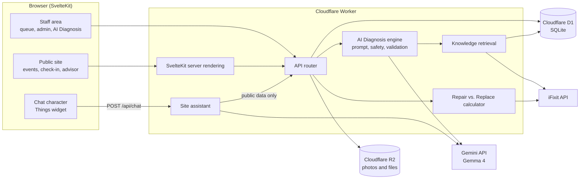

# RepairVision

> An AI-assisted platform for community repair cafés: it runs the café day to day, helps volunteers and owners work out what is wrong with a broken device, and tells people whether it is worth repairing or replacing.

**Live application:** https://repair-cafe-hub.circularity-cloudflare.workers.dev

## Team

**Team Name:** The Blacklisted

| Member            | Contribution                                                                                                                          |
| ----------------- | ------------------------------------------------------------------------------------------------------------------------------------- |
| Kanishk Rungta    | RepairVision AI Diagnosis (Gemma 4 multimodal, guided troubleshooting, safety guardrails), public device-owner sign-up, demo accounts |
| Keertan Vasani    | Repair vs. Replace Advisor, light and dark theme system, motion and the redesigned sign-in page                                       |
| Adiseshan Ramanan | Repair knowledge base and the retrieval that backs up each diagnosis                                                                  |
| Priyansh Narang   | Dark Raycast-style redesign, RepairVision logo and landing page, collapsible staff sidebar, Gemma site assistant                      |

## Problem Statement

### The Problem

Broken electronics and household items are thrown away every day, even though many of them have simple faults: a worn cable, a loose connector, a failed fuse. Repair cafés are one answer. They are free, volunteer-run sessions where people bring a broken item and fix it with the help of skilled volunteers.

Those cafés face three practical problems:

- **Running a session is hard.** Volunteers juggle paper sign-in sheets, a queue of visitors, who is fixing what, and reporting afterwards.
- **Diagnosis depends on who is in the room.** A volunteer who knows bicycles may not know hairdryers. Visitors arrive without knowing what is wrong or whether the item can be fixed.
- **People do not know whether repair is worth it.** Without a clear comparison of cost and waste, the default is to buy a new one.

### Why We Chose This Problem

Repair is one of the most direct ways to cut waste, but it only happens when it is easy and the person believes it will work. We wanted to give volunteer-run cafés the tools a professional repair shop would have, at no cost to them, and to bring AI in where it actually helps: understanding a fault and explaining the options, while always keeping a human in charge of the repair.

## Solution

RepairVision is a web platform for a repair café. Visitors find sessions and check in with a QR code. Volunteers run a live repair queue. Admins plan sessions and see their impact. On top of that, RepairVision adds three AI-assisted tools:

1. **AI Diagnosis** looks at a description and a photo of a broken device, suggests possible faults with evidence, proposes safe checks and asks one question at a time to narrow it down.
2. **Repair vs. Replace Advisor** compares the cost of repairing with the cost of replacing, allows for a repair that does not work, and shows the waste a repair avoids.
3. **Site assistant** is a chat character on every page. It answers questions from the café's live data ("What events are on right now?") and opens the right page for the visitor.

### Key Features

- **AI Diagnosis with Gemma 4:** photo and text in, up to three possible faults with supporting and missing evidence, safe non-invasive checks and guided follow-up questions. Every result is labelled provisional.
- **Grounded in a repair knowledge base:** more than 100 entries written by the team, the café's own completed repairs and iFixit guide links back up each suggested fault.
- **Repair vs. Replace Advisor:** a transparent verdict (repair, replace or close call) with the working shown, iFixit part links and CO2 avoided, for anyone, signed in or not.
- **Live site assistant:** a 3D chat character that answers from the website's live public data and navigates to the page an answer is about.
- **Repair café management:** QR check-in, live repair queue and waiting-room display, session scheduling, volunteers and skills, photos and impact statistics.
- **Accounts for everyone:** device owners can register and use AI Diagnosis themselves; staff get a separate, protected workspace.

## Innovation and Differentiation

- **AI that admits what it does not know.** Diagnoses list the evidence that supports each fault and the evidence still missing, ask the most useful next question, and pass through a hazard screen that does not depend on the model. Risky devices (mains appliances, e-bike batteries) get safety limits instead of instructions.
- **Answers grounded in real sources.** The knowledge base, past repairs at the same café and iFixit links give each suggestion a reason, instead of a bare assertion.
- **The decision, not just the fault.** Most repair tools stop at "what is wrong". The advisor answers the question people actually ask next: "is it worth fixing?", including the chance the repair fails and the waste avoided.
- **A chat assistant that cannot leak private data.** It reads only what the public website already shows, so no visitor's name, contact details or repair can ever reach the model, and it can only open pages of the site itself.
- **Free to run.** The whole platform runs on a free Cloudflare account and the free Gemma model through the Gemini API, which matters for volunteer-run cafés with no budget.

## Technical Implementation

### Architecture



### Technology Stack

| Category        | Technologies                                                                           |
| --------------- | -------------------------------------------------------------------------------------- |
| Frontend        | SvelteKit (Svelte 5), TypeScript, Tailwind CSS, Lenis, Leaflet, Chart.js, Lucide icons |
| Backend         | Cloudflare Workers, TypeScript, a small Fastify-style router on the Fetch API          |
| Database        | Cloudflare D1 (SQLite) with Drizzle ORM                                                |
| AI / ML         | Google Gemma 4 (`gemma-4-26b-a4b-it`) through the Gemini API                           |
| Infrastructure  | Cloudflare Workers, D1, R2 and static assets, deployed with Wrangler                   |
| APIs / Services | Gemini API, iFixit API, repaircafe.org directory, CARTO map tiles                      |

### How It Works

- **One Worker serves everything.** Cloudflare answers static files directly. Every other request reaches the Worker: `/api/*` goes to the API router, and pages are server-rendered by SvelteKit, which calls the API in-process rather than over the network.
- **Data** lives in D1 (events, repairs, users, settings) and R2 (photos, QR codes, generated images). Migrations run automatically on the first request.
- **AI Diagnosis:** the browser shrinks the photo, then `POST /api/repairvision/analyze` checks the image, screens the description for hazards, builds the prompt and calls Gemma 4. The reply must be valid JSON matching a schema; safety rules are applied again afterwards. Follow-up answers go to `/api/repairvision/followup`, up to five rounds.
- **Knowledge retrieval** (`POST /api/knowledge/retrieve`) matches each suggested fault against the team's knowledge base, the café's completed repairs and iFixit guides, by word overlap, so every source can say why it matched.
- **Repair vs. Replace** (`POST /api/advisor/estimate`) is plain arithmetic in pence with the working shown, plus an iFixit parts finder and an optional price service.
- **Site assistant** (`POST /api/chat`) reads the website's own public API (cafe, venue, sessions, stats, skills, FAQs), sends it to Gemma 4 with the question, and returns `{ answer, navigate }`. The page opens `navigate` only if it is one of the site's own pages.

### Technical Decisions

- **Cloudflare Workers, D1 and R2** so a café can host the whole platform on a free account, with no server to maintain.
- **Gemma 4 through the Gemini API**, called with plain `fetch` instead of an SDK, to keep the Worker small and fully compatible with the Workers runtime. The key is sent in a header, never in a URL.
- **Validate every model reply.** Diagnoses must parse against a Zod schema, and safety checks run in our code, not only in the prompt.
- **Never invent an answer.** When the API fails or is rate limited, the user sees an honest error. Prices are never made up: they come from the person, a link, or an optional price service.
- **Privacy by construction.** The public assistant can only see public data; staff retrieval never reads names or contact details; photos sent for diagnosis are not stored.
- **Per-person and per-visitor hourly limits**, counted in D1, protect the café's free AI quota.
- **Tested without the network.** All AI tests use fake model responses, so the suite of 199 tests runs offline in the real Workers runtime.

## Implementation During the Hackathon

RepairVision is built on an existing open repair-café management app, Circularity Repair Café Hub, which already provided the website, QR check-in, repair queues, scheduling, photos and statistics. That code was imported with its full history. **Everything below was built during the Hack Day:**

- **RepairVision AI Diagnosis:** Gemma 4 multimodal client, evidence-based prompts, multi-turn guided diagnosis, hazard screening and safety guardrails, hourly usage limits, and the photo diagnosis interface.
- **Public device-owner accounts:** registration, a device-owner dashboard and diagnosis for the public, with staff areas kept separate; gated one-click demo accounts.
- **Repair knowledge base and retrieval:** more than 100 team-written repair entries across computing, phones, audio and video, home appliances, tools and e-bikes, with risk levels and retrieval over the knowledge base, past repairs and iFixit.
- **Repair vs. Replace Advisor:** the calculator, parts finder, café settings, saving an estimate to a repair, and a public page.
- **Site assistant:** a Gemma-powered chat character that answers from live site data and navigates to the right page.
- **Design:** a new RepairVision identity and logo, a dark Raycast-inspired redesign, then a light and dark theme system with motion, a redesigned landing page and sign-in page, and a collapsible staff sidebar.
- **Tests and documentation** for every new feature.

### Team Contributions

- **Kanishk Rungta:** built RepairVision AI Diagnosis end to end (Gemma 4 client, prompts, safety guardrails, multi-turn engine, API and interface), public device-owner registration and access control, and the demo accounts.
- **Keertan Vasani:** built the Repair vs. Replace Advisor (calculator, parts finder, settings, saved estimates, public page), the light and dark theme system, motion and smooth scrolling, and the redesigned sign-in page.
- **Adiseshan Ramanan:** wrote the repair knowledge base and built the retrieval that grounds each diagnosis in the knowledge base, past repairs and iFixit guides, with risk levels and privacy tests.
- **Priyansh Narang:** led the visual redesign (dark design system, RepairVision logo, landing page), built the collapsible staff sidebar, and built the Gemma site assistant with its chat character and page navigation.

## Challenges and Learnings

- **Making AI output safe to show.** Free-text answers were not enough: we moved to strict JSON validated against a schema, with safety rules applied in our own code after every reply.
- **Working within the free tier.** Cloudflare's free plan allows about 10 ms of CPU per request, which shaped choices such as caching public pages and keeping AI calls as waiting time rather than computation.
- **Keeping private data private.** Giving the public assistant "the whole database" would have exposed visitors' details, so it reads only the public API and can only open the site's own pages.
- **Four people, one codebase, one day.** Small, focused commits, shared schemas in one package and a test suite that runs offline let us merge each other's work quickly and safely.

## Working Application

**Live Application:** _To be added after deployment._

Once deployed, the site can be tested without an account: browse sessions, use the Repair or Replace page, and ask the chat character questions. Register as a device owner to try AI Diagnosis, or sign in to the staff area to see the repair queue, the live board and the admin tools.

## Demo Video

**Demo Video:** _To be added._

The demo will cover a visitor checking in an item, a volunteer running AI Diagnosis on it, the Repair vs. Replace verdict, and the site assistant answering questions and opening pages.

## Open Source and AI Usage

### AI / Models

- **Google Gemma 4 (`gemma-4-26b-a4b-it`) via the Gemini API:** multimodal fault diagnosis and guided troubleshooting, and the site assistant's answers. Every AI result is labelled as provisional and is never written into a repair record automatically.
- **AI coding assistants** were used during development to help write code, tests and documentation. All changes were reviewed and tested by the team.

### Open Source Components

- **Circularity Repair Café Hub:** the repair-café management application this project is built on (website, check-in, queues, scheduling, statistics).
- **Things by Rothenhall (MIT):** the 3D chat character and chat panel. Vendored in `RepairVision/apps/web/static/things/` with its licence; one line added so the site can follow answers to a page.
- **three.js r128 (MIT):** renders the chat character.
- **SvelteKit, Svelte, Tailwind CSS:** the web application and its styling.
- **Drizzle ORM, Zod:** database access and validation of requests and AI replies.
- **Leaflet, Supercluster, Chart.js, Lenis, Lucide, Iconify, date-fns, bcryptjs, resvg-wasm, qrcode-generator:** maps, charts, smooth scrolling, icons, dates, legacy password checks, image rendering and QR codes.
- **Inter, Geist Mono, Fraunces, Mulish, Hanken Grotesk (SIL Open Font License, via Fontsource):** typefaces.
- **iFixit API:** repair guide and part links. Only titles and links are used; iFixit content is never given to the model.
- **repaircafe.org directory and CARTO map tiles:** the worldwide and nearby repair café maps.
- **Repair knowledge base:** original text written by The Blacklisted for this project.

Each component keeps its own licence. See `RepairVision/apps/web/static/things/README.md` for the vendored widget.

## Setup and Usage

### Prerequisites

- Node.js 22 or newer
- pnpm (the version is pinned in `RepairVision/package.json`)
- A Gemini API key from [Google AI Studio](https://aistudio.google.com/apikey), for the AI features
- A Cloudflare account, only for deployment

### Installation

```bash
git clone https://github.com/Kanishk-Rungta/RepairVision_AI.git
cd RepairVision_AI/RepairVision
pnpm install
```

### Environment Variables

Copy `RepairVision/apps/cloudflare/.dev.vars.example` to `RepairVision/apps/cloudflare/.dev.vars` (git-ignored) and set at least:

```env
GEMINI_API_KEY=your-gemini-api-key
```

Optional settings, all with sensible defaults:

```env
GEMMA_MODEL=gemma-4-26b-a4b-it
AI_DIAGNOSIS_HOURLY_LIMIT=30
AI_CHAT_HOURLY_LIMIT=20
DEMO_ACCOUNTS=true
PARTS_PRICE_API_URL=
PARTS_PRICE_API_KEY=
```

When deployed, set the key as a Worker secret instead: `npx wrangler secret put GEMINI_API_KEY` (from `RepairVision/apps/cloudflare`).

### Running the Project

```bash
pnpm cf:dev
```

The whole application, with a local database, runs at http://localhost:8787. For frontend work with hot reload, also run `pnpm dev:web` (http://localhost:5173). Tests: `pnpm cf:test`. Deploy: `pnpm cf:deploy`.

### Usage

1. Open http://localhost:8787 and complete the setup wizard: admin account, café details and home venue.
2. In the staff area, create a session under **Events** and publish it. On the day, start it from the dashboard.
3. Visitors scan the session's QR code to check in an item; volunteers pick it up from the **Repair queue**.
4. Use **AI Diagnosis** on a repair (or at `/diagnosis` as a device owner) and **Repair or replace** for a verdict.
5. Click the chat character in the corner and ask, for example, "Where are the events?"

Optional demo data: `python3 demo/seed.py --base-url http://localhost:8787`.

## Devpost Submission

**Devpost Project:** _To be added._

## Credits and License

### Credits

- Built by **The Blacklisted** (Kanishk Rungta, Keertan Vasani, Adiseshan Ramanan, Priyansh Narang) for Hacktoberfest Hack Day Coimbatore 2026, organised by INIT CLUB × iDEA CLUB with Major League Hacking.
- Based on **Circularity Repair Café Hub**, whose original commit history is preserved in this repository.
- AI by **Google Gemma 4** through the Gemini API.
- Chat character by **Things by Rothenhall** (MIT) and **three.js** (MIT).
- Repair guides and parts from **iFixit**; repair café directory from **repaircafe.org**; map tiles from **CARTO** with **OpenStreetMap** data.
- All other libraries listed under Open Source Components.

### License

_No licence has been chosen yet._ The upstream Circularity Repair Café Hub licence still needs to be confirmed before one is added, so none has been invented here. Vendored third-party files keep their own licences (MIT for Things and three.js).

## Submission Checklist

- [x] Project title and description added
- [x] All team members listed
- [x] Problem clearly explained
- [x] Reason for choosing the problem explained
- [x] Solution and key features documented
- [x] Innovation and differentiation explained
- [x] Architecture included
- [x] Technical implementation documented
- [x] Work completed during the hackathon documented
- [x] Team contributions documented
- [x] Working application is functional
- [ ] Live application link added where applicable
- [ ] Demo video added
- [x] AI and open-source components documented
- [x] Setup and usage instructions tested
- [x] Challenges and learnings documented
- [ ] Dev .to submission completed
- [ ] Dev.to link added
- [x] Credits added
- [ ] License added
- [ ] Repository is organized and complete
