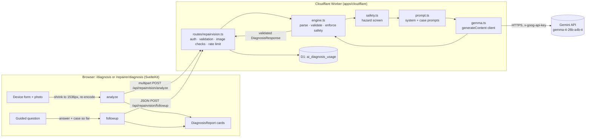

# RepairVision AI Diagnosis

RepairVision AI Diagnosis is a guided fault-finding assistant for repair café volunteers. It is built on Google's **Gemma 4** model (`gemma-4-26b-a4b-it`), accessed through the Gemini API.

A volunteer describes a faulty electronic device and can add a photo. Gemma 4 returns a structured, provisional diagnosis with:

- up to three possible faults, each with supporting and missing evidence;
- safe, non-invasive checks;
- one question that helps tell the leading causes apart.

Each answer is sent back as new evidence, and the diagnosis is updated. A session allows up to five questions.

This feature was added for Hacktoberfest Hack Day Coimbatore 2026. It is separate from the repair café management features inherited from Circularity Repair Café Hub (check-in, repair queues, photos, scheduling and admin), and it does not change how those features work.

> **This is an AI-assisted tool, not a qualified technician.** Every diagnosis is labelled as provisional and unverified. The tool never changes a repair record and never confirms a fault.

---

## Architecture



| File | Role |
| --- | --- |
| `packages/shared/src/repairvision.ts` | Zod schemas and types: request validation and validation of the model's reply (`diagnosisResultSchema`), plus limits. |
| `apps/cloudflare/src/services/repairvision/gemma.ts` | Calls the Gemini API with `fetch`. Reads configuration and maps every failure to a `GemmaError` with a stable code. |
| `apps/cloudflare/src/services/repairvision/prompt.ts` | The diagnostic system instruction (steps A–E, safety and honesty rules, JSON shape) and the prompts for the first analysis and for follow-ups. |
| `apps/cloudflare/src/services/repairvision/safety.ts` | A pattern-based hazard screen and post-processing guardrails. These do not depend on the model. |
| `apps/cloudflare/src/services/repairvision/engine.ts` | `analyzeDevice` and `continueDiagnosis`: screen, prompt, call, extract JSON, validate, enforce safety. It does not read or write repair records, so it can later be connected to them. |
| `apps/cloudflare/src/services/repairvision/rateLimit.ts` | A per-person hourly limit, counted in D1. |
| `apps/cloudflare/src/routes/repairvision.ts` | The three API routes. |
| `apps/cloudflare/src/db/migrations/0003_ai_diagnosis_usage.ts` | The usage table used by the rate limit. It is not included in backups. |
| `apps/web/src/lib/repairvision.ts` | The browser client, photo preparation and error messages. |
| `apps/web/src/lib/components/DiagnosisReport.svelte` | The result cards. |
| `apps/web/src/routes/repairer/diagnosis/+page.svelte` | Staff entry point; the guided session is shared in `lib/components/DeviceDiagnosis.svelte`. |
| `apps/cloudflare/test/repairvision.test.ts` | Automated tests. All network calls are faked. |

Small edits to existing files: `env.ts` (new optional settings), `app.ts` (registers the routes), `db/migrate.ts` and `db/schema.ts` (usage table), `lib/staff/nav.ts` (the **AI Diagnosis** menu item), `routes/repairer/job/[id]/+page.svelte` (the **Analyze with RepairVision AI** button), `packages/shared/src/index.ts` (export) and `.gitignore` (allows `.dev.vars.example`).

## Gemma 4 integration

- **Model:** `gemma-4-26b-a4b-it` by default. Set `GEMMA_MODEL` to change it. The Worker never switches models on its own. If the configured model is unavailable, the request fails with `ai/model_unavailable`.
- **Endpoint:** `POST https://generativelanguage.googleapis.com/v1beta/models/{model}:generateContent`, as documented in [Gemma on the Gemini API](https://ai.google.dev/gemma/docs/core/gemma_on_gemini_api).
- **Why not the SDK:** the REST API is called with the Worker's built-in `fetch` rather than `@google/genai`. This adds no dependency and is guaranteed to run on workerd.
- **Request:** a `systemInstruction`, then a single user turn. When there is a photo, it comes first as `inlineData` (base64), followed by the case text. The `generationConfig` contains `temperature: 0.3`, `maxOutputTokens: 8192`, `thinkingConfig.thinkingLevel` (`high` by default, or `minimal`) and `responseMimeType: "application/json"`.
- **Structured output:** the Gemma documentation does not list `responseSchema` for Gemma, so no schema is sent to the API. Instead, the prompt specifies the exact JSON shape, the API is asked for JSON mode, and the reply is parsed defensively (code fences and surrounding text are stripped) and validated with Zod. If the API rejects JSON mode for the model, the same request is sent once more to the same model without it. Set `GEMMA_JSON_MODE=false` to skip JSON mode entirely.
- **Thoughts:** if any parts come back marked `thought: true`, they are discarded.
- **Images:** JPEG, PNG and WebP up to 4 MB. The browser first shrinks photos to a longest edge of 1536 px and re-encodes them. The Worker then checks the declared type against the file's magic bytes, reads the dimensions and removes JPEG metadata such as GPS before sending the photo. Photos are never stored, and are sent only on the first analysis. Follow-ups carry the earlier visual observations as text.

### Errors

The API never makes up an answer. Every failure becomes a JSON error `{ error, code }`, and the page shows a message with a **Try again** button.

| Situation | HTTP | `code` |
| --- | --- | --- |
| `GEMINI_API_KEY` missing | 503 | `ai/not_configured` |
| Key rejected (401/403) | 502 | `ai/auth_failed` |
| Model not found (404) | 502 | `ai/model_unavailable` |
| Gemini API rate limit (429) | 429 (+ `Retry-After`) | `ai/rate_limited` |
| Per-person hourly limit | 429 | `ai/user_rate_limited` |
| No answer within `GEMMA_TIMEOUT_MS` | 504 | `ai/timeout` |
| Network error / 5xx | 503 | `ai/unavailable` |
| Blocked by the API's own filters | 422 | `ai/blocked` |
| Empty reply | 502 | `ai/empty_response` |
| Reply not valid JSON or fails the schema | 502 | `ai/invalid_response` |
| Bad input | 400 | `validation/failed` |
| Wrong file type / not really an image | 415 | `upload/unsupported_type` |
| Photo over 4 MB | 413 | `upload/too_large` |

Neither the uploaded photo nor the description is ever logged. If a reply fails validation, only the names of the failing fields are logged.

## Setup

### Requirements

- Node.js 22 or newer, and the pnpm version in `package.json` (run `corepack enable`, or use `corepack pnpm …`).
- A Gemini API key from [Google AI Studio](https://aistudio.google.com/apikey).

### Local development

```sh
cd RepairVision
pnpm install
cp apps/cloudflare/.dev.vars.example apps/cloudflare/.dev.vars
# edit apps/cloudflare/.dev.vars and set GEMINI_API_KEY=<your key>
pnpm cf:dev            # builds the web app and runs the Worker on http://localhost:8787
```

Open http://localhost:8787, complete setup or sign in, and choose **AI Diagnosis** from the menu.

For live-reloading the frontend, run `pnpm dev:web` in a second terminal and use http://localhost:5173. It proxies `/api` to the Worker.

`.dev.vars` is git-ignored. Never commit a real key.

### Deployed Worker

```sh
cd RepairVision/apps/cloudflare
pnpm exec wrangler secret put GEMINI_API_KEY      # paste the key when prompted
```

You can also add it as a **Secret** in the Cloudflare dashboard (Workers & Pages → repair-cafe-hub → Settings → Variables and Secrets). Optional plain variables are listed below. `keep_vars` in `wrangler.jsonc` means a deploy does not wipe them.

| Variable | Default | Purpose |
| --- | --- | --- |
| `GEMINI_API_KEY` | — (required, secret) | Gemini API key |
| `GEMMA_MODEL` | `gemma-4-26b-a4b-it` | Model id |
| `GEMMA_THINKING_LEVEL` | `high` | `high` or `minimal` (faster) |
| `GEMMA_JSON_MODE` | `true` | `false` stops requesting JSON mode |
| `GEMMA_TIMEOUT_MS` | `90000` | Request timeout (1 000–300 000) |
| `AI_DIAGNOSIS_HOURLY_LIMIT` | `30` | Requests per signed-in person per hour |

The key is used only in the Worker. It is sent in the `x-goog-api-key` header and never reaches the browser.

## API

All routes require a signed-in device owner, volunteer or admin (`Authorization: Bearer <access token>`, the same as the rest of `/api/repairer`).

### `GET /api/repairvision/status`

```json
{ "configured": true, "model": "gemma-4-26b-a4b-it", "maxRounds": 5, "maxImageBytes": 4194304,
  "imageMimeTypes": ["image/jpeg", "image/png", "image/webp"] }
```

### `POST /api/repairvision/analyze` (multipart/form-data)

| Field | Required | Notes |
| --- | --- | --- |
| `deviceName` | yes | 2–120 characters |
| `manufacturer` | no | up to 120 |
| `model` | no | up to 120 |
| `problem` | yes | 5–2000 characters |
| `image` | no | JPEG/PNG/WebP, up to 4 MB |

```sh
curl -X POST http://localhost:8787/api/repairvision/analyze \
  -H "Authorization: Bearer $TOKEN" \
  -F deviceName="Wired USB mouse" \
  -F problem="The mouse repeatedly disconnects whenever I move the USB cable." \
  -F "image=@mouse.jpg;type=image/jpeg"
```

The response has this shape. The values below illustrate the format and are not a recorded model output:

```json
{
  "diagnosis": {
    "device": { "name": "Wired USB mouse", "category": "Computer peripheral", "model": null },
    "summary": "…",
    "reportedSymptoms": ["…"],
    "visualObservations": ["…"],
    "possibleCauses": [
      { "title": "…", "likelihood": "high", "reasoning": "…",
        "supportingEvidence": ["…"], "missingEvidence": ["…"] }
    ],
    "safeChecks": [{ "instruction": "…", "purpose": "…" }],
    "nextQuestion": { "question": "…", "options": ["Yes", "No", "Not tested"] },
    "safetyWarnings": [],
    "evidenceUpdate": null,
    "uncertainty": "…",
    "status": "needs_more_information"
  },
  "meta": { "model": "gemma-4-26b-a4b-it", "round": 0, "maxRounds": 5, "imageAnalyzed": true,
            "hazards": [], "notices": [], "generatedAt": "…" }
}
```

`status` is one of `needs_more_information`, `likely_cause_identified` (still unverified) or `refer_to_professional`. Likelihoods are always qualitative (`low`/`medium`/`high`), never numbers.

### `POST /api/repairvision/followup` (JSON, up to 64 KB)

```json
{
  "context": { "deviceName": "Wired USB mouse", "manufacturer": null, "model": null,
               "problem": "The mouse repeatedly disconnects whenever I move the USB cable." },
  "imageAnalyzed": true,
  "previous": { "...": "the diagnosis object from the last response" },
  "history": [ { "question": "…", "answer": "…" } ],
  "question": "Does the same issue occur in another USB port?",
  "answer": "Yes"
}
```

`history` holds the questions answered before this one, with at most four entries. The response has the same shape as `analyze`, with `meta.round` set to 1–5 and `diagnosis.evidenceUpdate` explaining what the new answer changed.

## How guided diagnosis works

1. **First analysis (round 0).** Gemma follows steps A–D from the system instruction: it understands the symptoms and the photo, proposes up to three hypotheses with evidence for and against, recommends safe checks and asks one distinguishing question.
2. **Each answer (rounds 1–5).** The browser sends back the original case, the previous assessment and every question and answer so far. The server stores nothing. Everything is re-validated, and the prompt marks the latest answer as new evidence, lists the questions already asked, and tells Gemma to re-rank, drop or add hypotheses and explain the change in `evidenceUpdate` (step E).
3. **The server enforces the rules:**
   - a repeated question is dropped;
   - round 5 ends with no further question;
   - a request with more than four earlier answers is refused.
4. **Restart** clears the session in the browser.
5. **From a repair.** The **Analyze with RepairVision AI** button on a repair's page opens `/repairer/diagnosis?job=<id>`. The page loads the repair through the existing authorised `/api/repairer/jobs/:id` endpoint and fills in the item, brand, fault description and the check-in photo. Nothing is written back to the repair.

## Safety and limitations

- **Two layers of safety.** The system instruction forbids dangerous advice. Separately, `safety.ts` screens the user's own words, independently of the model, for:
  - mains or exposed live wiring;
  - swollen, leaking or overheating batteries;
  - microwave ovens;
  - high voltage, CRTs and large capacitors;
  - smoke, sparks, burning or overheating.

  When a hazard is found, the Worker:
  - adds its own **Stop** warning, labelled *Flagged by the RepairVision safety screen*;
  - removes any check that involves opening the device;
  - ends the question round;
  - sets the status to `refer_to_professional`.

  For every device, it also removes steps that would bypass a fuse, interlock or other protection, or that would puncture, press or charge a damaged battery.
- **The screen is pattern-based.** It errs towards warning too often. It never declares a device safe, and it can miss hazards described in unusual words.
- **What a photo can show.** A photo shows the outside of a device. The prompt forbids claims about hidden internal faults, and the UI says so.
- **What the model is told not to do.** The prompt forbids invented part numbers, manual contents, specifications and links. The output is still model-generated and must be checked.
- **Best results.** Low-voltage devices such as USB peripherals, keyboards, mice and headphones give the most useful results.
- **Persistence.** Sessions are not saved. Reloading the page ends the session.
- **Privacy.** The device details, the description and the photo are sent to Google's Gemini API, so Google's terms for the API apply. Do not include visitors' personal details in the description.

## Testing

### Automated tests

```sh
cd RepairVision
pnpm cf:test
```

`apps/cloudflare/test/repairvision.test.ts` runs inside workerd with faked network responses. It covers:

- text-only requests;
- text and image requests, including JPEG GPS metadata stripping;
- valid parsing and normalisation;
- malformed, incomplete and empty replies;
- a missing API key (engine and route);
- timeouts;
- Gemini rate limits with `Retry-After`;
- unavailable models and rejected keys;
- unsupported and disguised file types;
- oversized photos;
- follow-ups with retained context;
- repeated-question removal and the round limit;
- the dangerous-device (microwave) safety scenario and hazard screening;
- removal of protection-bypassing steps;
- the per-person hourly limit;
- refusal without signing in.

### Manual testing

1. Set `GEMINI_API_KEY` in `apps/cloudflare/.dev.vars` and run `pnpm cf:dev`.
2. Sign in and open **AI Diagnosis**.
3. Enter *Wired USB mouse* with the problem *"The mouse repeatedly disconnects whenever I move the USB cable."*, upload a photo of a mouse, and click **Analyze Device**.
4. Check that the results show device overview, visual observations, two or three possible faults with evidence, numbered checks, a question and the provisional notice.
5. Choose an answer and click **Continue Diagnosis**. The **What changed after your answer** box should explain how the hypotheses moved, and the earlier question should appear in the history.
6. Try a text-only case, for example *USB keyboard, some keys don't work*.
7. Try a hazard, for example *Microwave, sparks inside and burning smell*. You should see Stop warnings, no invasive checks and no further questions.
8. Click **Restart diagnosis** and try another device.
9. Open a repair in the queue and use **Analyze with RepairVision AI**. The form should be prefilled, and the repair itself should be unchanged.
10. Remove the key and restart. The page should say the feature is not set up, and analysis should fail with a clear message.

## Future improvements

- Retrieve repair guides (for example iFixit, already used elsewhere in the hub) and match historical cases to ground hypotheses.
- Optionally save diagnosis sessions to a repair record, clearly marked as AI-assisted and unverified.
- Allow a new photo during follow-ups ("photograph the connector").
- Use a model-level response schema if Gemma on the Gemini API documents support for it.
- Add moderation and evaluation sets of real repair café cases to measure diagnostic quality.

## Public onboarding

After the owner completes the one-time `/setup`, anyone can create an account at `/register`. The homepage has **Diagnose my device**, and the header and sign-in page link to registration. Registration signs the user in immediately and opens `/dashboard`, with a direct link to `/diagnosis`. Opening diagnosis while signed out preserves the destination through sign-in or registration.

Public accounts use the `user` role. They can access diagnosis and follow-up endpoints, but cannot access staff repair records, session photos or admin endpoints. They are excluded from public team listings and volunteer counts. Registration validates name, email and password, normalizes emails, handles duplicates, hashes passwords and limits attempts per address. Existing login, refresh cookies and logout also work for these accounts.

The SQLite role column is already plain text, so no database migration is required. Diagnosis sessions remain in the current tab and are not saved. The `GEMINI_API_KEY` secret is still required for model requests; account creation works independently of it.

## Site assistant (the chat character)

The character in the corner of the site (the Things widget, see
`apps/web/static/things/README.md`) answers visitors' questions with the same
Gemma model and `GEMINI_API_KEY` as AI Diagnosis. Nothing is scripted.

How a question is answered (`apps/cloudflare/src/routes/chat.ts`,
`apps/cloudflare/src/services/chat/assistant.ts`):

1. The widget sends `POST /api/chat` with `{ "question": "...", "page": "/current/path" }`.
2. The hub reads its own public API in-process: the cafe and its FAQs, the
   home venue, upcoming and recent sessions (including one running now),
   the numbers, and what it repairs and who repairs it. This is exactly what
   the public pages show, so a visitor's name, contact details or repair can
   never reach the model.
3. Gemma gets that data, today's date and time in the cafe's `TZ`, the list of
   pages it may open, and the question. It replies with JSON:
   `{ "answer": "...", "navigate": "/events" | null }`.
4. `navigate` is kept only if it is on the list (fixed public pages plus
   `/events/<id>` and `/team/<id>` from the data); anything else is dropped.
5. The site shows the answer and, when `navigate` is set, opens that page
   after a short pause, with the chat still open.

Limits: open to everyone, 20 questions per visitor address per hour
(`AI_CHAT_HOURLY_LIMIT`), questions up to 500 characters. Thinking is set to
`minimal` and the wait is capped at 45 seconds, so answers come back quickly.
Without `GEMINI_API_KEY` the endpoint answers 503 `ai/not_configured` and the
widget says it cannot answer right now.

Tests: `apps/cloudflare/test/chat.test.ts` (no real API calls).
